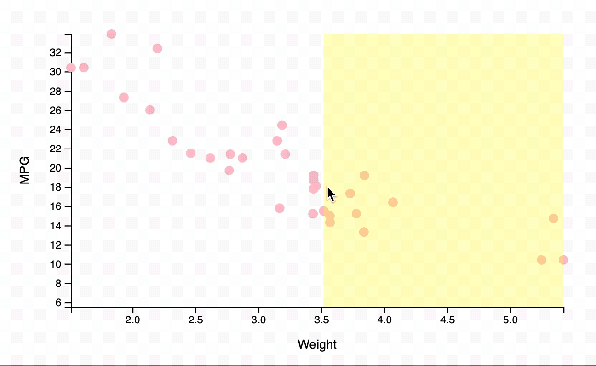
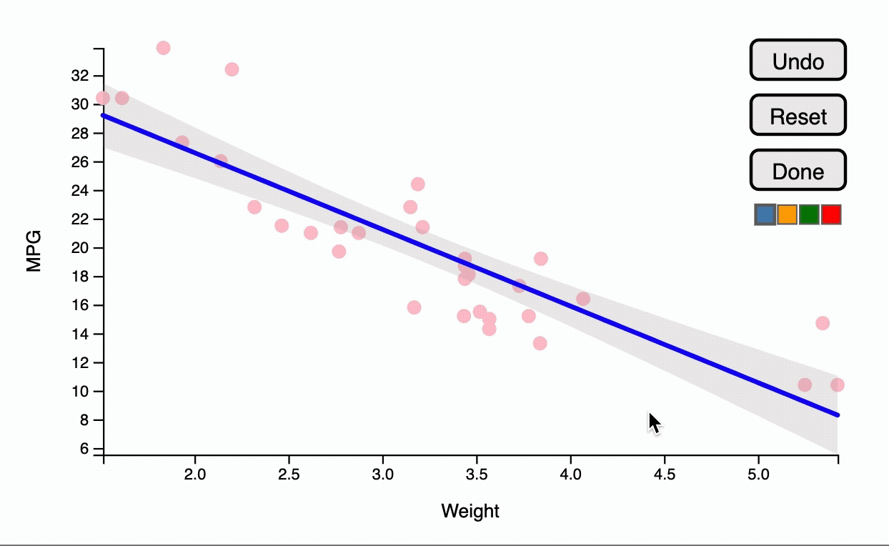

<!-- README.md is generated from README.Rmd. Please edit that file -->

# youdrawitR

<!-- badges: start -->

[](https://github.com/Alisa-Krasilnikov/youdrawitR/actions/workflows/R-CMD-check.yaml)
<!-- badges: end -->

## Overview

‘You Draw It’ is a feature that allows users to interact with a chart
directly by drawing a line on their computer screen with a mouse.
Originally introduced by the New York Times in 2015 for the purpose of
interactive reading, this package adapts the use of the ‘You Draw It’
method as a tool for interactive testing of graphics.

## Installation

You can install the development version of youdrawitR from
[GitHub](https://github.com/) with:

``` r
#install.packages("devtools")
devtools::install_github("Alisa-Krasilnikov/youdrawitR")
```

## Usage

Both functions can be used with `geom_point`, `geom_smooth`, and
`geom_line.` Note that `drawit()` can only be used with two `geoms` at a
time, while `sketchit()` supports multiple layers without restrictions.

### `drawit`: Guided Drawing

`drawit()` allows users to draw a single continuous line across the
plot, enforcing a one-to-one mapping between x-values and user-drawn
y-values. This is particularly useful for assessing how users estimate
regression lines or expected trends.

The drawing region can be customized, and the underlying data or model
can optionally be revealed after the user completes their drawing.

``` r
library(ggplot2)
library(youdrawitR)

p <- ggplot(mtcars, aes(x = wt, y = mpg)) +
  geom_point(size = 1.5, colour = "pink") +
  geom_smooth(method = "lm") +
  labs(x = "Weight", y = "MPG")

drawit(p, 
       show_on_finish = TRUE, 
       draw_start = 3.5)
```



### `sketchit`: Freeform Drawing

`sketchit()` enables more flexible interaction, allowing users to draw
multiple lines without a one-to-one constraint between x and y values.
This makes it suitable for more exploratory or open-ended tasks.

Users can control the number of lines drawn (minimum and maximum), and
customize visual properties such as color. See the documentation for
available options.

``` r
library(ggplot2)
library(youdrawitR)

p <- ggplot(mtcars, aes(x = wt, y = mpg)) +
  geom_point(size = 1.5, colour = "pink") +
  geom_smooth(method = "lm") +
  labs(x = "Weight", y = "MPG")

sketchit(p, 
       max_lines = 10,
       min_lines = 2)
```



### `Shiny` Integration

Both `drawit()` and `sketchit()` can be used within `Shiny` applications
to capture user input for further analysis.

- `drawit()` returns a complete mapping from x-values to user-drawn
  y-values. Every x-value in the ggplot2 dataset receives a
  corresponding user-drawn value.

- `sketchit()` returns detailed drawing data, including x and y
  coordinates of each line segment, along with attributes such as color
  and drawing order.

These outputs can be accessed via `Shiny` inputs and used for downstream
tasks, such as comparing user predictions to model results or analyzing
interaction behavior.

### Status

This package is under active development. Features and APIs may change
as the project evolves.

If you encounter issues or have suggestions, please open an issue at:

<https://github.com/Alisa-Krasilnikov/youdrawitR/issues>
